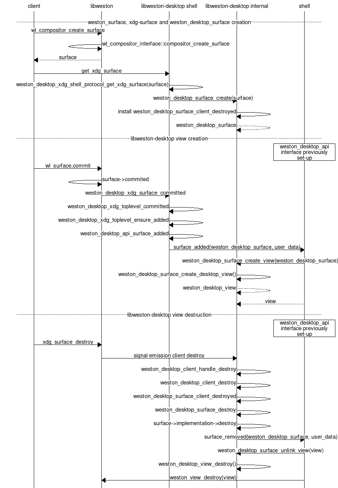

libweston-desktop
=================

.. _libweston-desktop:

libweston-desktop is an abstraction library for compositors wanting to support
desktop-like shells.  The API was designed from xdg-shell, the recommended
shell for applications to use.

The library handles:

- toplevel surfaces, with all the other being internal implementation details
- Xwayland special surfaces (override-redirect) are special-cased into a
  dedicated layer
- error checking as well as specification rules, like sizes constraint for
  maximized and fullscreen

The library versioning is the same as libweston. If one of them break ABI
compatibility, the other will too.

weston_desktop_api interface
----------------------------

The shell has to do define a few callbacks in the interface struct specifically
defining the callbacks found in :type:`weston_desktop_api` in order to manage
toplevel surfaces. Afterwards, one would be calling :func:`weston_desktop_create` to
install them. Finalizing with it would require calling :func:`weston_desktop_destroy`.

State tracking objects
----------------------

libweston-desktop uses internal entites to keep track of the toplevel surface state
by using two private/internal objects: :type:`weston_desktop_view` and
:type:`weston_desktop_surface`.
Creation of views is :numref:`libweston-desktop-surface-creation`.

.. _libweston-desktop-surface-creation:

   Internal weston_desktop_surface and weston_desktop_view creation and destruction

libweston-deskop API
--------------------

.. doxygengroup:: libweston-desktop
   :content-only:

libweston-deskop interal API
----------------------------

.. doxygengroup:: libweston-desktop-internal
   :content-only:
